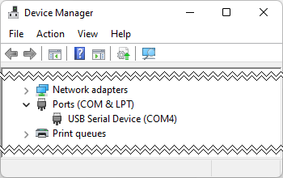
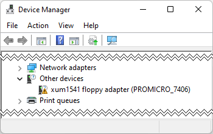
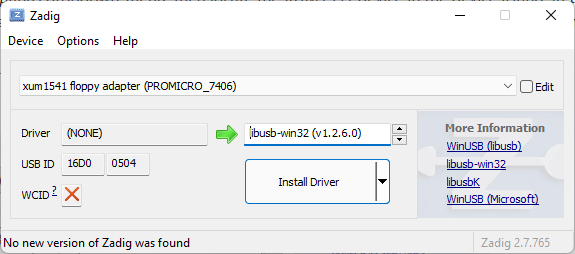
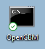

# XUM1541

# Introduction

An OpenCBM compatible interface for the 1541 disk drive that can be used to backup and restore floppies.

# Components and assembly

Component selection isn't terribly critical, whathever you have in hand that fit the values will probably work just fine. Values for the led resistors will drive them at around 18ma which may be quite bright, increase the values if it's the case. R1 to R5 can be anything between 1KΩ and 100KΩ. The decoupling capacitor C1 should be at least 10v or more.

As alway, when assembling, start with the smallest components (resistor and capacitor) and grow in size as you go.

|Qty|Ref|Value|Description|
|---|---|-----|-----------|
|1|C1|100nF|Ceramic Disc Capacitors 100nF 2.54mm Radial Leads (10v or more)|
|1|D1|Red Led|Light Emitting Diodes Red Diffused 5mm 20mA/1.9V|
|1|D2|Green Led|Light Emitting Diodes Green Diffused 5mm 20mA/2.2V|
|1|J1|Conn_02x06_Odd_Even|Pin Headers Righ Angle 2.54mm 2x6 Pin|
|1|J2|DIN-45322|6 pin Female DIN connector (240°) DIN 45322/60130-9 IEC-17|
|5|R1-R5|100kΩ|Resistors 100kΩ Axial Leaded Through Hole|
|1|R6|180Ω|Resistors 180Ω Axial Leaded Through Hole|
|1|R7|150Ω|Resistors 150Ω Axial Leaded Through Hole|
|1|SW1|SW_Push|Micro-Switch 6x6mm|
|1|U1|Arduino_Pro_Micro|SparkFun Arduino Pro Micro ATmega32U4|
|1|U2|74LS06|DIP-14 Inverters|

## Firmware

The firmware source code is available in the OpenCBM repository if you want to compile it yourself but since the code is stable and mature, it is not really needed and we can use a precompiled version. At the time of release, the current version is V08. 

Theses instructions are for Windows, but all the needed softwares are available for about any other platforms.

|Software|Local Link|Official Repository|
|--------|:----------:|:-----------:|
|Firmware|[xum1541-PROMICRO_7406-v08.hex](Firmware/xum1541-PROMICRO_7406-v08.hex)|[OpenCBM xum1541 Firmware](https://github.com/zyonee/opencbm/tree/master/xum1541)|
|WinAVR|N/A|[WinAVR Latest Release](https://sourceforge.net/projects/winavr/files/latest/download)|
|Zadig|N/A|[Zadig Latest Release](https://zadig.akeo.ie/)|
|OpenCBM|N/A|[OpenCBM Latest Release](https://spiro.trikaliotis.net/opencbm#download)|

Install WinAVR and open Device Manager, then connect the Arduino Pro Micro. A new Serial Port should appear after a few seconds.

This is the monitor serial port, but not the one we want, to put the Arduino into programming mode, reset it twice, you should see the Com Port number change, which tell you that we are in Firmware Update mode.

The Arduino will stay in this mode for about 8 seconds then revert back to the monitor serial port mode. So you need to be a little bit fast. First, note the Com Port number when the device is in Firmware Update mode (In this case, COM4), then open a command prompt and go to the bin directory of WinAVR. Once there, enter the following command but do not press enter (Adjust the path and filename of the firmware as needed):

~~~
avrdude -p m32u4 -c avr109 -P com4 -U flash:w:xum1541-PROMICRO_7406-v08.hex
~~~

Then, reset the Arduino twice to put it in programming mode and press enter. If everything goes well you should get a result like this:

~~~
C:\WinAVR-20100110\bin>avrdude -p m32u4 -c avr109 -P com4 -U flash:w:xum1541-PROMICRO_7406-v08.hex

Connecting to programmer: .
Found programmer: Id = "CATERIN"; type = S
    Software Version = 1.0; No Hardware Version given.
Programmer supports auto addr increment.
Programmer supports buffered memory access with buffersize=128 bytes.

Programmer supports the following devices:
    Device code: 0x44

avrdude: AVR device initialized and ready to accept instructions

Reading | ################################################## | 100% 0.00s

avrdude: Device signature = 0x1e9587
avrdude: NOTE: FLASH memory has been specified, an erase cycle will be performed
         To disable this feature, specify the -D option.
avrdude: erasing chip
avrdude: reading input file "xum1541-PROMICRO_7406-v08.hex"
avrdude: input file xum1541-PROMICRO_7406-v08.hex auto detected as Intel Hex
avrdude: writing flash (9026 bytes):

Writing | ################################################## | 100% 1.29s

avrdude: 9026 bytes of flash written
avrdude: verifying flash memory against xum1541-PROMICRO_7406-v08.hex:
avrdude: load data flash data from input file xum1541-PROMICRO_7406-v08.hex:
avrdude: input file xum1541-PROMICRO_7406-v08.hex auto detected as Intel Hex
avrdude: input file xum1541-PROMICRO_7406-v08.hex contains 9026 bytes
avrdude: reading on-chip flash data:

Reading | ################################################## | 100% 0.41s

avrdude: verifying ...
avrdude: 9026 bytes of flash verified

avrdude: safemode: Fuses OK

avrdude done.  Thank you.

C:\WinAVR-20100110\bin>
~~~

The Arduino will reset after the Firmware Upload and a new device should appear in device manager:

## Driver installation

Next, we need to install the driver for the new device, start **Zadig** and select the **xum1541 floppy adapter (PROMICRO_7406)** device, next change the driver to **libusp-win32**, finally click **Install Driver** and wait for the confirmation message.

## OpenCBM Installation

Unzip OpenCBM into a temporary directory and open a **Command Prompt** in **Administrator** mode, switch to the temporary OpenCBM directory and type the following command:

~~~
install.cmd xum1541
~~~

Install will start, check for a previous installation and advice that it will request elevated privileges, press any key to start installation or CTRL-C to abort.

~~~
find: /i: No such file or directory
OpenCBM installation script
===========================

Elevating privileges in order to install OpenCBM.
Please grant the rights on the UAC prompt,
or I will not be able to continue

Your installation will continue in another window.
Press any key to continue . . .
~~~

Another window will open and installation will continue, when it ask to install drivers, answer no since they have already been install.

~~~
Continuing...
24 File(s) copied
5 File(s) copied
2 File(s) copied
3 File(s) copied
Working directory = 'C:\Program Files\opencbm\',
system  directory = 'C:\Windows\system32\',
driver  directory = 'C:\Windows\system32\DRIVERS\'.
Using plugin: 'xum1541' with filename 'opencbm-xum1541.dll'.
++++ Install: 'xum1541' with filename 'opencbm-xum1541.dll'.
Copying '.\opencbm-xum1541.dll' to 'C:\Windows\system32\opencbm-xum1541.dll'

=================================================
=== OpenCBM v0.4.99.104 for  xum1541
=== installation done
===
=== Add C:\Program Files\opencbm to your PATH to use the command line tools there.
=================================================

I could install the necessary USB drivers if you like.
If you want this, then please
1. attach your device, and then
2. answer the following question with "y", without parenthesis:

Do you want me to install the necessary USB drivers for you? (y/n) n
NO.

That's it, I am finished.
Press any key to continue . . .
~~~

## Testing

First, test without connecting anything, open an OpenCBM Shell  and type the following command:

~~~
cbmctrl detect
~~~

You should get the following error:

~~~
C:\Users\xum1541>cbmctrl detect
error: no xum1541 device found
An error occurred opening OpenCBM, aborting...

C:\Users\xum1541>
~~~

Next, connect the XUM1541 but do not connect a drive to it and try the command again, this time your should not see any output. This confirm that the XUM1541 is detected and working correctly.

~~~
C:\Users\xum1541>cbmctrl detect

C:\Users\xum1541>
~~~

Finally, disconnect the XUM1541 from the computer and make sure the 1541 is powered off, connect the 1541 to the XUM1541 with the IEC Cable, connect the XUM1541 to the computer and finally turn on the 1541. You may now try the command again, and this time you should see the device ID and model of the connected disk drive.

~~~
C:\Users\xum1541>cbmctrl detect
 8: 1541-II

C:\Users\xum1541>
~~~

## Basic OpenCBM commands

This is definitly not an exaustive guide, but just a few commands to test and do basic tasks.

### Reading disk directory

Reading the disk directory can be done with the **cbmctrl dir \<DISKID\>** command:

~~~
C:\Users\xum1541>cbmctrl dir 8
0 ."test/demo  1/85 " 84 2a
14   "how to use"       prg
8    "how part two"     prg
7    "how part three"   prg
4    "vic-20 wedge"     prg
1    "c-64 wedge"       prg
4    "dos 5.1"          prg
9    "printer test"     prg
6    "disk addr change" prg
12   "view bam"         prg
15   "display t&s"      prg
4    "check disk"       prg
11   "performance test" prg
5    "seq.file.demo"    prg
18   "rel.file.demo"    prg
7    "sd.backup.c16"    prg
7    "sd.backup.plus4"  prg
10   "sd.backup.c64"    prg
7    "print.64.util"    prg
7    "print.c16.util"   prg
7    "print.+4.util"    prg
13   "uni-copy"         prg
30   "c64 basic demo"   prg
35   "+4 basic demo"    prg
8    "load address"     prg
7    "unscratch"        prg
5    "header change"    prg
403 blocks free.
00, ok,00,00

C:\Users\xum1541>
~~~

### Backing up disk to PC or restore to disk from PC

Making backup or restoring a disk can be done with the **d64copy \<SRC\> \<DST\>** command:

Backup disk in drive id **8** to disk image **1541-demo.d64**:
~~~
C:\Users\xum1541>d64copy 8 1541-demo.d64
[Warning] growing image file to 683 blocks
 1: *********************
 2: *********************
 3: *********************
 4: *********************
 5: *********************
 6: *********************
 7: *********************
 8: *********************
 9: *********************
10: *********************
11: *********************
12: *********************
13: *********************
14: *********************
15: *********************
16: *********************
17: *********************
18: *******************
19: *******************
20: *******************
21: *******************
22: *******************
23: *******************
24: *******************
25: ******************
26: ******************
27: ******************
28: ******************
29: ******************
30: ******************
31: *****************
32: *****************
33: *****************
34: *****************
35: *****************       100%   683/683
683 blocks copied.

C:\Users\xum1541>
~~~

Restore disk image **1541-demo.d64** to disk in drive id **8**:

~~~
C:\Users\xum1541>d64copy 1541-demo.d64 8
 1: *********************
 2: *********************
 3: *********************
 4: *********************
 5: *********************
 6: *********************
 7: *********************
 8: *********************
 9: *********************
10: *********************
11: *********************
12: *********************
13: *********************
14: *********************
15: *********************
16: *********************
17: *********************
18: *******************
19: *******************
20: *******************
21: *******************
22: *******************
23: *******************
24: *******************
25: ******************
26: ******************
27: ******************
28: ******************
29: ******************
30: ******************
31: *****************
32: *****************
33: *****************
34: *****************
35: *****************       100%   683/683
683 blocks copied.

C:\Users\xum1541>
~~~

### Format a disk

Format a disk in drive id **8**:

~~~
C:\Users\xum1541>cbmformat 8 XUM1541_FORMAT,01 -c

C:\Users\xum1541>cbmctrl dir 8
0 ."xum1541⌂format  " 01 2a
664 blocks free.
00, ok,00,00

C:\Users\xum1541>
~~~

For more information, see the official [OpenCBM](https://opencbm.trikaliotis.net/) documentation.

# Licence

This work is licensed under the Creative Commons Attribution-NonCommercial-ShareAlike 4.0 International License. To view a copy of this license, visit http://creativecommons.org/licenses/by-nc-sa/4.0/ or send a letter to Creative Commons, PO Box 1866, Mountain View, CA 94042, USA.

# Revision History

|Revision  |Description                    |
|:--------:|-------------------------------|
|1.0       |Initial prototype              |
